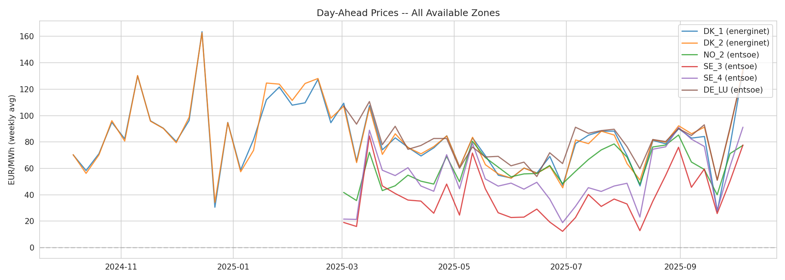
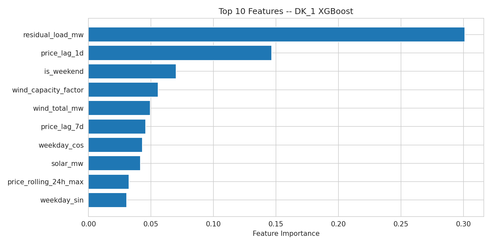
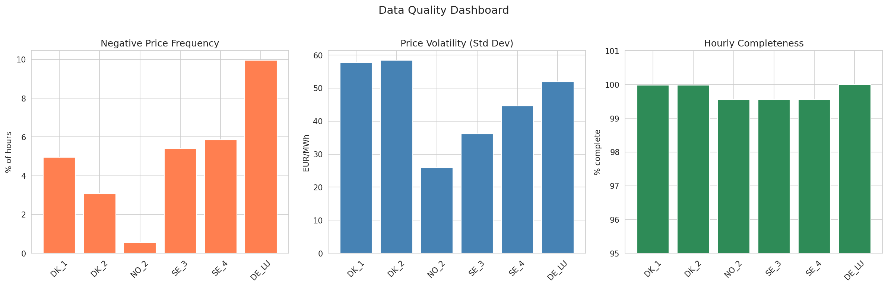
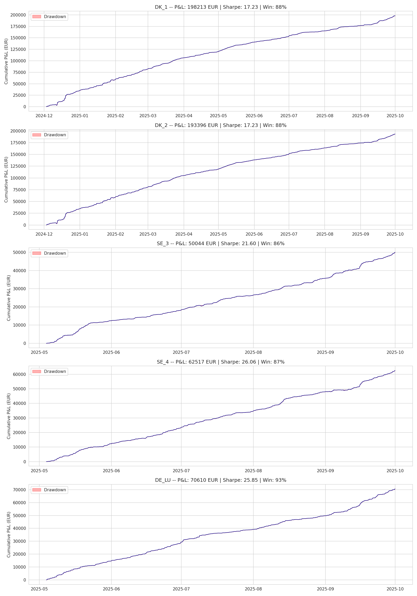

# Day-Ahead Electricity Price Forecasting

XGBoost-based day-ahead price forecasting pipeline for European electricity bidding zones (DK1, DK2, NO2, SE3, SE4, DE-LU).

## Architecture

```
data/raw/          Parquet cache (one file per source/zone/datatype)
src/da_forecast/
  config.py        Zone definitions, interconnectors, feature availability rules
  data.py          Multi-source data loading with quality handling + audit logging
  sources/         Energinet REST API + ENTSO-E Transparency Platform wrappers
  features/        Lag features (gate-closure aware), calendar, residual load, weather
  models/          XGBoost day-ahead forecaster (single + per-hour modes)
  validation/      DST handling, completeness checks, outlier detection
  backtest/        Walk-forward engine, trading strategies, Sharpe/drawdown metrics
notebooks/         Analysis notebooks (00-09)
scripts/           Data fetching + pipeline runner
```

## Data sources

| Source | Zones | Auth | Datasets |
|--------|-------|------|----------|
| [Energinet DataService](https://www.energidataservice.dk/) | DK1, DK2 | None (free) | Prices, production mix, load, wind/solar forecasts |
| [ENTSO-E Transparency](https://newtransparency.entsoe.eu/) | All EU zones | [API key](https://transparencyplatform.zendesk.com/hc/en-us/articles/12845911031188-How-to-get-security-token) | Prices, generation, load, cross-border flows |

## Quick start

```bash
uv sync
cp .env.example .env  # add ENTSO-E API key if available

# Fetch data (fetchers skip zones that already have cached data)
uv run python scripts/fetch_energinet_data.py   # DK zones, no auth needed
uv run python scripts/fetch_entsoe_data.py       # All zones, needs API key

# Run full pipeline (all zones)
uv run python scripts/run_pipeline.py

# Or explore via notebooks
jupyter notebook notebooks/
```

## Results

### Model performance (March-September 2025)

| Zone  | MAE (EUR/MWh) | Baseline MAE | Improvement |
|-------|:---:|:---:|:---:|
| DK_1  | 21.19 | 34.04 | +37.8% |
| DK_2  | 24.01 | 33.01 | +27.3% |
| NO_2  | 15.58 | 19.03 | +18.1% |
| SE_3  | 17.66 | 27.77 | +36.4% |
| SE_4  | 26.31 | 33.30 | +21.0% |
| DE_LU | 14.39 | 30.15 | +52.3% |

Baseline = naive previous-week-same-hour forecast. DE_LU has the lowest absolute error, likely because the large German market is more liquid and less volatile than the smaller Nordic zones.

### Walk-forward backtest (threshold strategy, 1 MWh positions)

| Zone  | P&L (EUR) | Sharpe | Win% | Trades |
|-------|---:|:---:|:---:|---:|
| DK_1  | 198,213 | 17.23 | 88% | 3,616 |
| DK_2  | 193,396 | 17.23 | 88% | 3,616 |
| SE_3  |  50,044 | 21.60 | 86% | 1,769 |
| SE_4  |  62,517 | 26.06 | 87% | 1,783 |
| DE_LU |  70,610 | 25.85 | 93% | 1,782 |

**How to read the P&L**: The backtest trades 1 MWh per position at the day-ahead auction. You do not need to hold 198K EUR upfront -- day-ahead trading is not like buying stocks. You submit bids to the auction and settle daily. The capital required is exchange membership + collateral (margin), typically 5-10% of your maximum hourly exposure.

**Sharpe ratios are unrealistically high** (real-world strategies achieve 1-3). The backtest assumes perfect execution at clearing prices, zero imbalance costs, and no model degradation over time. See notebook 09 for a detailed discussion of degradation haircuts and realistic revenue projections.

### Output plots






## Key design decisions

- **No synthetic fallback**: pipeline returns `None` rather than silently substituting fabricated data
- **Gate-closure aware features**: all lag features shift by >=24h to respect the 12:00 CET day-ahead auction deadline
- **Forward-fill imputation** (<=6h gaps) with full audit logging -- no interpolation, since generation has regime shifts
- **Negative prices are valid**: outlier detection explicitly avoids flagging negative prices (wind surplus signal)
- **Walk-forward backtesting** with strict temporal separation -- no look-ahead bias
- **Multi-source reconciliation**: Energinet is authoritative for DK zones; ENTSO-E fills adjacent zones and cross-validates

## Pipeline speed note

The walk-forward backtest is intentionally slow: it retrains XGBoost for each test day to maintain strict temporal separation (no look-ahead bias). With 6 zones and ~200 test days each, this means ~1200 model training iterations. This is correct behavior. Use `--no-backtest` to skip the backtest for a faster pipeline run, or `--zone DK_1` to run a single zone.
