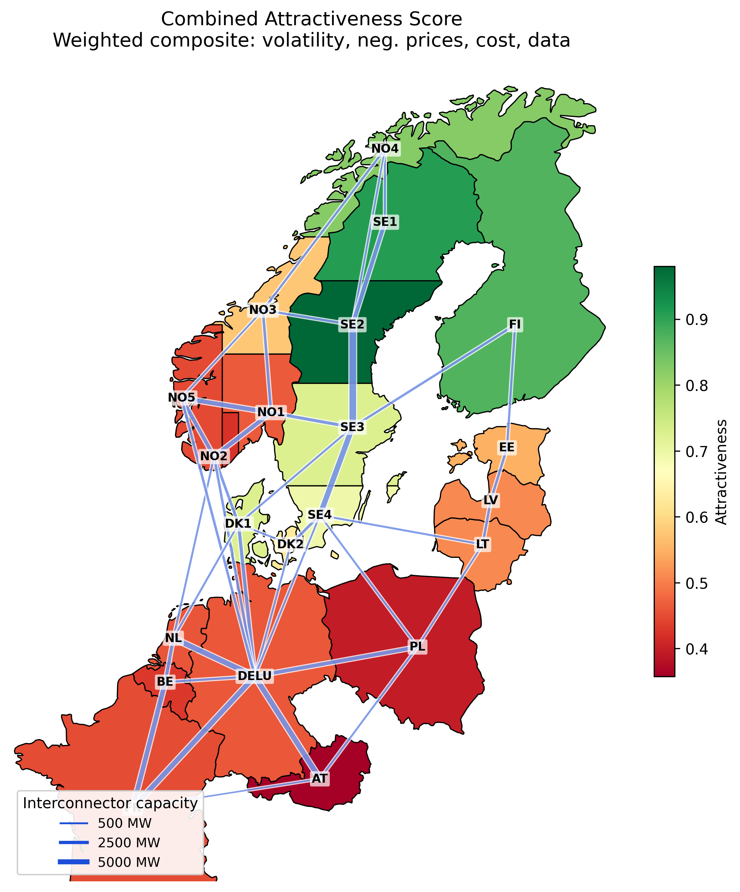
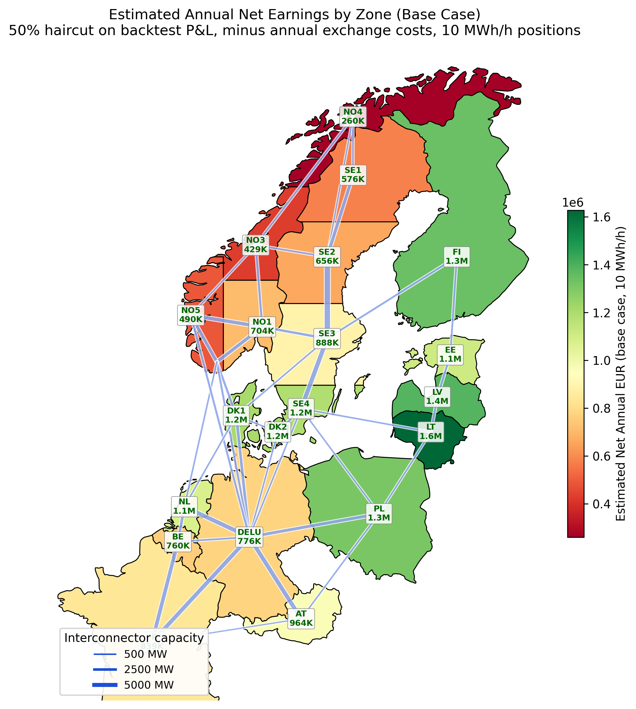

# Day-Ahead Electricity Price Forecasting

XGBoost-based day-ahead price forecasting pipeline for 21 European electricity bidding zones across the Nordics, Baltics, and Central-West Europe.

## Architecture

```
src/da_forecast/
  config.py          Zone definitions, interconnectors, trading params, quality thresholds
  data.py            Multi-source data loading with quality handling + audit logging
  sources/
    energinet.py     Energinet REST API (DK zones)
    entsoe.py        ENTSO-E Transparency Platform (all EU zones)
    openmeteo.py     Open-Meteo weather data (temperature, wind speed, solar irradiance)
    cache.py         Parquet-based caching with incremental merge
  features/          Lag features (gate-closure aware), calendar, residual load, weather
  models/            XGBoost day-ahead forecaster (single + per-hour modes)
  validation/
    completeness.py  Gap detection, daily completeness reports
    timezone.py      DST transition handling (23/25-hour days)
    outliers.py      Rolling z-score outlier detection (negative prices preserved)
    schema.py        DataFrame schema validation (columns, dtypes, timezone)
  monitoring/
    drift.py         Model performance tracking + drift detection
  backtest/          Walk-forward engine, trading strategies, Sharpe/drawdown metrics
notebooks/           Analysis notebooks (00-09)
scripts/             Data fetching, pipeline runner, backtest, heatmap generation
tests/               108 tests (pytest)
```

## Data sources

| Source | Zones | Auth | Datasets |
|--------|-------|------|----------|
| [Energinet DataService](https://www.energidataservice.dk/) | DK1, DK2 | None (free) | Prices, production mix, load, wind/solar forecasts |
| [ENTSO-E Transparency](https://newtransparency.entsoe.eu/) | All 21 zones | [API key](https://transparencyplatform.zendesk.com/hc/en-us/articles/12845911031188-How-to-get-security-token) | Prices, generation, load, cross-border flows |
| [Open-Meteo](https://open-meteo.com/) | All zones | None (free) | Temperature, wind speed (10m/100m), solar radiation |

### Supported bidding zones

| Region | Zones |
|--------|-------|
| Denmark | DK_1 (West), DK_2 (East) |
| Norway | NO_1 (South-East), NO_2 (South), NO_3 (Middle), NO_4 (North), NO_5 (West) |
| Sweden | SE_1 (North), SE_2 (North-Central), SE_3 (Central), SE_4 (South) |
| Finland | FI |
| Germany | DE_LU (Germany-Luxembourg) |
| Benelux | NL (Netherlands), BE (Belgium) |
| France | FR |
| Central Europe | AT (Austria), PL (Poland) |
| Baltics | EE (Estonia), LV (Latvia), LT (Lithuania) |

## Quick start

```bash
uv sync
cp .env.example .env  # add ENTSO-E API key if available

# Fetch data (fetchers skip zones that already have cached data)
uv run python scripts/fetch_energinet_data.py   # DK zones, no auth needed
uv run python scripts/fetch_entsoe_data.py       # All zones, needs API key
uv run python scripts/fetch_weather_data.py      # Weather data, no auth needed

# Run full pipeline (all zones)
uv run python scripts/run_pipeline.py

# Fast sampled backtest (all zones in ~2 minutes)
uv run python scripts/fast_backtest.py --minutes 3 --samples 50

# Generate zone analysis maps
uv run python scripts/generate_eu_heatmap.py
uv run python scripts/generate_earnings_map.py

# Run tests
uv run pytest tests/ -v

# Or explore via notebooks
jupyter notebook notebooks/
```

## Results (Jan 2024 -- Mar 2026, 21 zones)

### Backtest P&L (sampled days, 1 MWh positions, after transaction costs)

| Zone  | P&L (EUR) | Sharpe | Win% | Days tested |
|-------|---:|:---:|:---:|:---:|
| LV    | 59,961 | 19.30 | 82% | 78 |
| FI    | 56,474 | 24.64 | 94% | 78 |
| PL    | 55,471 | 19.24 | 92% | 76 |
| DK_1  | 53,172 | 23.44 | 88% | 78 |
| DK_2  | 53,610 | 25.02 | 88% | 78 |
| SE_4  | 51,327 | 20.49 | 89% | 76 |
| NL    | 44,919 | 22.40 | 93% | 76 |
| DE_LU | 34,686 | 28.29 | 93% | 78 |

Sharpe ratios are unrealistically high (real-world strategies achieve 1-3). The backtest assumes perfect execution and no imbalance costs. We apply a 50% haircut for realistic revenue estimates.

Full results for all 20 zones with earnings projections are in the pipeline output.

### Zone analysis




## Pipeline features

- **Data quality gates**: warns when completeness < 90%, imputation > 5%, or prices outside expected range
- **Imputation audit log**: every forward-filled value is logged to `output/imputation_audit.csv`
- **Schema validation**: checks column names, dtypes, and timezone awareness on all loaded data
- **Model drift detection**: tracks daily MAE per zone, flags when 7-day rolling exceeds 2x 30-day rolling
- **No synthetic fallback**: pipeline returns `None` rather than silently substituting fabricated data
- **Gate-closure aware features**: all lag features shift by >=24h to respect the 12:00 CET auction deadline
- **Negative prices are valid**: outlier detection explicitly avoids flagging negative prices (wind surplus signal)
- **Walk-forward backtesting**: strict temporal separation, no look-ahead bias
- **Fast sampled backtest**: samples evenly-spaced days with caching for quick iteration (~2 min for all zones)
- **Multi-source reconciliation**: Energinet is authoritative for DK zones; ENTSO-E fills adjacent zones

## Testing

108 tests covering data loading, validation, feature engineering, model training, and backtesting:

```bash
uv run pytest tests/ -v
```

## Docker

```bash
docker build -t da-forecast .
docker run -v ./data:/app/data -v ./output:/app/output da-forecast
```
